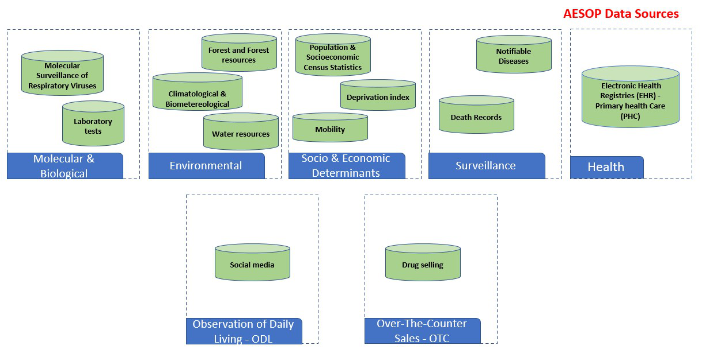

Welcome to AESOP data documentation!
=================================== 

This documentation provides a description of all databases used in the `Alert-Early System of Outbreaks with Pandemic Potential (AESOP) <http://aesop.health/about-us>`_ project. 

ÆSOP aims to be a data-driven surveillance system for the early alert of infectious disease outbreaks and their potential threats. To achieve this goal, the system will be built on the integration of existing multimodal data routinely collected from different sources, as well as on a set of analytical models for pandemic detection and transmission forecast.

ÆSOP relies on databases that report and describe health, biological, pharmaceutical, environmental, climate, human mobility, social media, and socioeconomic features of Brazil.

   
Schematic overview of the AESOP data source.

In the next sections, we explain each database associated with this project, including the repository they are stored in, access permissions and an overview of the data files and their formats. In addition, we provide detailed descriptions of the methods used to collect the data, the computational processing, and the potential for data reuse. 

Links, references, codes, program, or data processing workflow is provided to facilitate understanding or use the data.

.. note::

   This documentation is under active development.

Contents
--------

.. toctree::

   health
   surveillance
   biological
   pharmaceutical
   web_based
   social_economical
   environmental
   human_mobility

