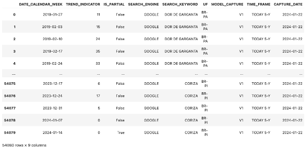
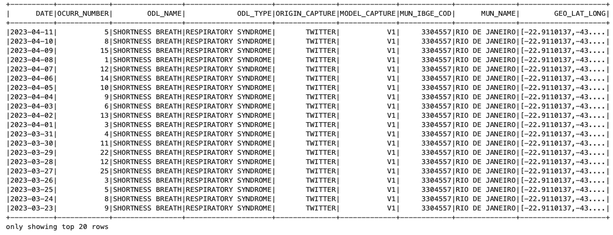

Web-based data
=====
Updated: 2024-05-27

A subgroup within the scope of Event-based Surveillance (EBS) [1]_ [2]_ is focused on Web-based EBS (w-EBS), which pertains to events where the data is sourced from the web. This approach leverages online platforms, social media, news websites, and other internet-based resources to gather real-time information on public health events, enabling rapid detection and response to potential outbreaks and health threats.

However, web-based data has challenges that need to be considered, among which we highlight:

      * Data integrity: Maintaining the veracity and accuracy of the data.
      * Noise filtration and relevance: Developing advanced methods to filter out irrelevant content and pinpoint pertinent information.
      * Sampling bias: Addressing the variation in web-based (e.g. social media and internet) usage across different populations to avoid sampling bias.
      * Technological tools: Using natural language processing, machine learning, and big data analytics to transform unstructured data into actionable insights.
      * Integration with traditional initiatives: How to do it and obtain results to generate warnings/alerts.

Therefore, within the scope of Aesop, we consider that web-based data is for context, being a "side-car" in the process of evaluating a notice.

Search Engine
-------------

Description
^^^^^^^^^^^
Search engines are considered in studies as a promising source for the early detection of events that may represent potential public health issues [3]_ [4]_. Within the scope of the Aesop project, search engines serve as a "side-car" data source, meaning they require another primary source to guide the alert. Search engines such as Google, Bing, Yahoo, and others are valuable for understanding population search patterns, which can indicate trends of interest related to health topics that contribute to epidemiological surveillance.

On one hand, this is an opportune process that can aid decision-making by enabling the issuance of an alert when something outside the norm (an anomaly) is detected [5]_. Search engine data can reveal real-time insights into public health concerns by identifying spikes in search queries for symptoms, diseases, or other health-related topics. This proactive approach allows for a more responsive and dynamic public health monitoring system.

Thus, search engines, while secondary, play a critical contextual role in the overall surveillance framework, providing a complementary layer of data that enhances the ability to detect and respond to public health threats more swiftly.

Data access information
^^^^^^^^^^^^^^^^^^^^^^^
The primary data source used is Google Trends [6]_, which monitors the search trends of expressions from Google's search engine and establishes a trend indicator for these expressions. Google Trends provides valuable insights into what people are searching for over time, allowing for the identification of patterns and spikes in search queries related to various topics, including public health concerns.

By analyzing this data, we can gain an understanding of the public's interest and awareness regarding specific health issues, which can serve as an early warning system for potential outbreaks or health threats. The data from Google Trends is particularly useful because it is updated in real-time and can be accessed independently of the health system, offering a wide-reaching and timely perspective on emerging public health trends.

However, it is important to note that the data from Google Trends is aggregated and anonymized, which means that while it can highlight trends at a broad level, it may not provide detailed insights at a more granular level. For instance, search trends are typically attributed to states rather than smaller geographic areas, which may limit the specificity of the data. Additionally, the interpretation of search trends must consider cultural and socio-economic factors, as well as variations in internet access and digital literacy among different populations.

Overall, the use of Google Trends as a data source provides a valuable tool for enhancing public health surveillance and decision-making processes, helping to identify and respond to potential health threats more effectively.

Methods of data collection
^^^^^^^^^^^^^^^^^^^^^^^^^^
To obtain data from the Google Trends API, we used the Python library pytrends [7]_. Queries were conducted with information about the words/expressions (search terms) of interest, the period, and the states from which we desired data. The search terms were classified into three groups: symptoms, diseases, and medications. All terms were selected with the aim of identifying group syndrome interests, for example:

      * Symptoms: cough, sore throat, shortness of breath, runny nose, etc.
      * Diseases: flu, cold, COVID-19, etc.
      * Medications: benegrip, cough medicine, corticosteroid, etc.

These search terms were assigned a version number, allowing us to track changes to any terms or subgroups over time and enabling future comparisons.

The data is stored and processed on the project's high-performance computing (HPC) infrastructure. This pipeline ultimately generates datasets that can be consumed and integrated into various project approaches, feeding the dashboard as "side-car" information.

Currently, data is collected weekly to maintain compatibility with other datasets, and the data spans from the current date back to five years ago. However, we are considering working with shorter periods in the future and exploring the possibility of obtaining daily information, as the source allows for this approach.

Data-specific information
^^^^^^^^^^^^^^^^^^^^^^^^^
The data is stored in the HPC in parquet.gzip format within folders containing information for each week. Each file represents a search expression and period, along with the search engine used and the version of the search terms, allowing flexibility for future adjustments. These files have a small volume, with each state having an entry for each search term and an index representing the trend.

The file to be shared is generated in the final stage of the processing pipeline, where all the information is aggregated into a single file with a size of approximately 5 MB in CSV format.

Limitations of the dataset
^^^^^^^^^^^^^^^^^^^^^^^^^^
Datasets generated from Google Trends have limitations regarding the attribution of searches to areas smaller than states. Therefore, initially, the datasets are associated with states.

It is crucial to integrate search engine data with other traditional and validated data sources to ensure accuracy and reliability. This integration helps mitigate issues such as data noise, sampling bias, and the relevance of the information gathered. Employing advanced technologies like natural language processing, machine learning, and big data analytics can enhance the ability to filter and analyze search engine data, transforming it into actionable insights.

Additionally, cultural factors, internet access, and digital literacy among the population must be considered. Variations in these areas can influence the volume and type of search queries, potentially affecting the representativeness of the data. Populations with limited internet access or lower levels of digital literacy might be underrepresented in search engine data, leading to biases. Understanding these limitations is essential for accurately interpreting the data and ensuring it complements other surveillance methods effectively.

Furthermore, while search engine data offers universal accessibility and the potential to be obtained independently of the health system, this advantage is conditioned by the cultural and socio-economic context of the population. Differences in health-seeking behaviors, language, and economic status can impact how individuals use search engines for health information. Recognizing these factors is crucial to leveraging search engine data effectively and ensuring it provides a meaningful contribution to public health surveillance.

Data dictionary
^^^^^^^^^^^^^^^
+---------------------+-------------------------------------------------------------+------------+------------------------------------------+
| Field Name          | Description                                                 | Type       | Format Sample                            | 
+=====================+====================================================+========+============+==========================================+
| DATE_CALENDAR_WEEK  | Date representing the first day of the week (Sunday)        | string     | 2023-12-24                               | 
+---------------------+-------------------------------------------------------------+------------+------------------------------------------+
| TREND_INDICATOR     | Indicator with the search trend for the term in the period  | string     | 58                                       |
+---------------------+-------------------------------------------------------------+------------+------------------------------------------+
| IS_PARTIAL          | Whether the data is still partial for the week in question  | string     | False                                    | 
+---------------------+-------------------------------------------------------------+------------+------------------------------------------+
| SEARCH_ENGINE       | What is the search engine                                   | string     | GOOGLE                                   |  
+---------------------+-------------------------------------------------------------+------------+------------------------------------------+
| SEARCH_KEYWORD      | Keyword or expression searched                              | string     | DOR DE GARGANTA                          | 
+---------------------+-------------------------------------------------------------+------------+------------------------------------------+
| UF                  | State code                                                  | string     | BR-SE                                    |
+---------------------+-------------------------------------------------------------+------------+------------------------------------------+
| MODEL_CAPTURE       | Version of the searched words and expressions               | string     | V1                                       | 
+---------------------+-------------------------------------------------------------+------------+------------------------------------------+
| TIME_FRAME          | Time interval                                               | string     | TODAY 5-Y                                | 
+---------------------+-------------------------------------------------------------+------------+------------------------------------------+
| CAPTURE_DATE        | Date of capture                                             | string     | 2024-01-22                               | 
+---------------------+-------------------------------------------------------------+------------+------------------------------------------+

.. note::

   Dataset variables generated from Google Trends only. However, the structure will be maintained for other captures in search engines and the representation of types is considered the file in parquet format.

   
Sample of the produced dataset.

Social Media
-------------

Description
^^^^^^^^^^^
The utilization of social media platforms for public health surveillance has become an integral part of Event-based Surveillance (EBS) systems. Social media [8]_ [9]_, in particular, offers a vast amount of user-generated content that can be analyzed to identify emerging health concerns. This data includes posts, tweets, and other forms of digital communication that can provide early indicators of public health issues, such as the spread of infectious diseases 

Despite its potential, there are significant challenges associated with using social media data for health surveillance. Data integrity and accuracy are major concerns, as the information shared on these platforms may be unreliable or false. Additionally, noise filtration is necessary to eliminate irrelevant content and focus on pertinent information. Sampling bias is another critical issue, as the demographics of social media users do not represent the entire population, leading to potential biases in the data. Advanced technological tools like natural language processing, machine learning, and big data analytics are essential for transforming unstructured social media data into actionable insights. Integrating this data with traditional health surveillance methods can enhance the overall effectiveness of public health monitoring systems.

Data access information
^^^^^^^^^^^^^^^^^^^^^^^
Access to Twitter data was initially achieved through an application using the free version of the Twitter API. When Twitter became X, it was necessary to purchase the API [10]_ to filter messages containing a specific set of sentences. The current Twitter, now X, is one of the most widely used social networks in the world. Brazil ranks sixth globally in terms of X users, with 22 million users [11]_.

Consolidated data from public messages on X are processed while preserving the private information of individuals. Only aggregated information with sentence frequencies is made available.

Methods of data collection
^^^^^^^^^^^^^^^^^^^^^^^^^^
To access the X (Twitter) API, the Python library Tweepy was used [12]_. Using this library, daily messages in Portuguese are obtained for a set of words and expressions associated with respiratory syndrome. For example, "cough," "fever," "shortness of breath," "sore throat," "headache," "diarrhea," "vomiting," "runny nose," etc. If a message contains one or more of these terms, it is captured and temporarily stored in a transient area for further processing, thus generating a file per day.

The next step in processing the messages is to convert the messages to compressed .parquet format and store them in the RAW zone of the HPC cluster used in the project.

Subsequently, the messages are processed using Natural Language Processing (NLP), being tokenized and validated. One of the crucial processes is the transformation of words and expressions into columns, turning them into a variable that will have the value TRUE when the sentence is present in the tokenized message.

It is also necessary to geocode the messages, as most of them are not geolocated because the option to capture this information is usually disabled by the platform users, as observed in the captures. Therefore, it is necessary to use the location provided by the user, which is often imprecise and arbitrary (e.g., "Brazil," "Salvador, Bahia," "Narnia"). For this geolocation, the Google Maps API is used to geocode the messages based on the location information provided by the users of platform X.

Data-specific information
^^^^^^^^^^^^^^^^^^^^^^^^^
The original messages are preserved and maintained in the RAW zone of the project's data lake, and the processed messages are made available for use by the project groups in the shared zone of the HPC cluster. The messages captured for the set of sentences related to respiratory syndrome are less than 1 MB in size per day of capture, in parquet.gzip format.

Limitations of the dataset
^^^^^^^^^^^^^^^^^^^^^^^^^^
The limitations are similar to those identified for web-based data. However, to achieve greater accuracy in messages from platform X, it is necessary to perform geocoding on the messages, which results in a success rate of approximately 3% of the captured messages. Thus, we are initially using data from the capital cities for validation. For other cities that are not in urban areas or are in regions with fewer resources, the number of messages is insufficient to generate a series capable of contributing to the analyses.

Another limitation considered is the change in licensing for platform X (formerly Twitter), which has become a significant cost. This is being evaluated to identify its uses and potential before acquiring it for use in routine syndrome surveillance, such as in the Aesop project.

Data dictionary
^^^^^^^^^^^^^^^

+---------------------+------------------------------------------------------------------------+------------+------------------------------------------+
| Field Name          | Description                                                            | Type       | Format Sample                            | 
+=====================+========================================================================+============+==========================================+
| DATE                | Date of sending the message                                            | string     | 2023-04-11                               | 
+---------------------+------------------------------------------------------------------------+------------+------------------------------------------+
| OCURR_NUMBER        | Mumber of times the word or expression appears in the day              | string     | 5                                        |
+---------------------+------------------------------------------------------------------------+------------+------------------------------------------+
| ODL_NAME            | Name assigned to the observation being searched for in the message     | string     | SHORTNESS BREATH                         | 
+---------------------+------------------------------------------------------------------------+------------+------------------------------------------+
| ODL_TYPE            | Category or syndrome that is associated with observation               | string     | RESPIRATORY SYNDROME                     |  
+---------------------+------------------------------------------------------------------------+------------+------------------------------------------+
| ORIGIN_CAPTURE      | Origin of data capture                                                 | string     | TWITTER                                  | 
+---------------------+------------------------------------------------------------------------+------------+------------------------------------------+
| MODEL_CAPTURE       | version of the applied capture model                                   | string     | V1                                       |
+---------------------+------------------------------------------------------------------------+------------+------------------------------------------+
| MUN_IBGE_COD        | Municipality code                                                      | string     | 3304557                                  | 
+---------------------+------------------------------------------------------------------------+------------+------------------------------------------+
| MUN_NAME            | Municipality name                                                      | string     | RIO DE JANEIRO                           | 
+---------------------+------------------------------------------------------------------------+------------+------------------------------------------+
| GEO_LAT_LONG        | Latitude and longitude associated with the municipality's centroid     | string     | [-22.9110137,-43.344255]                 | 
+---------------------+------------------------------------------------------------------------+------------+------------------------------------------+

.. note::

   The datasets currently extracted and made available use processed data from the X Platform with sentences related to respiratory syndrome. The dataset structure supports expansions.

   
Sample of the produced dataset.

News
-------------

Expected availability in July 2024.

.. rubric:: References

.. [1] Milinovich, G. J., Williams, G. M., Clements, A. C. A., & Hu, W. (2014). Internet-based surveillance systems for monitoring emerging infectious diseases. Lancet Infect Dis, 14(2), 160–168. https://doi.org/10.1016/s1473-3099(13)70244-5
.. [2] Wilson, A. E., Lehmann, C. U., Saleh, S. N., Hanna, J., & Medford, R. J. (2021). Social media: A new tool for outbreak surveillance. Antimicrobial Stewardship and Healthcare Epidemiology, 1(1). https://doi.org/10.1017/ASH.2021.225.
.. [3] Rabiolo, A., Alladio, E., Morales, E., McNaught, A. I., Bandello, F., Afifi, A. A., & Marchese, A. (2021). Forecasting the COVID-19 Epidemic by Integrating Symptom Search Behavior Into Predictive Models: Infoveillance Study. Journal of Medical Internet Research, 23(8). https://doi.org/10.2196/28876.
.. [4] Wang, D., Lang, J. C., & Chen, Y. H. (2024). Assessment of using Google Trends for real-time monitoring of infectious disease outbreaks: a measles case study. Scientific Reports, 14(1). https://doi.org/10.1038/S41598-024-60120-8.
.. [5] Bento, A. I., Nguyen, T., Wing, C., Lozano-Rojas, F., Ahn, Y. Y., & Simon, K. (2020). Evidence from internet search data shows information-seeking responses to news of local COVID-19 cases. Proceedings of the National Academy of Sciences of the United States of America, 117(21), 11220–11222. https://doi.org/10.1073/PNAS.2005335117/SUPPL_FILE/PNAS.2005335117.SD01.XLSX
.. [6] Google Trends. (n.d.). Retrieved May 26, 2024, from https://trends.google.com.br/trends/
.. [7] pytrends · PyPI. (n.d.). Retrieved May 26, 2024 from https://pypi.org/project/pytrends/
.. [8] Bour, C., Ahne, A., Schmitz, S., Perchoux, C., Dessenne, C., & Fagherazzi, G. (2021). The use of social media for health research purposes: scoping review. J Med Internet Res, 23(5), e25736. https://doi.org/10.2196/25736.
.. [9] Wilson, A. E., Lehmann, C. U., Saleh, S. N., Hanna, J., & Medford, R. J. (2021). Social media: A new tool for outbreak surveillance. Antimicrobial Stewardship & Healthcare Epidemiology, 1(1), e50. https://doi.org/10.1017/ASH.2021.225.
.. [10] X API | Products | Twitter Developer Platform. (n.d.). Retrieved May 26, 2024, from https://developer.x.com/en/products/twitter-api.
.. [11] Statista - The Statistics Portal for Market Data, Market Research and Market Studies. (n.d.). Retrieved May 26, 2024, from https://www.statista.com/.
.. [12] Tweepy Documentation — tweepy 4.14.0 documentation. (n.d.). Retrieved May 26, 2024, from https://docs.tweepy.org/en/stable/.

**Contributors**

+-------------------+-----------------------------------------------------------------+
| Roberto Carreiro  | Center for Data and Knowledge Integration for Health (CIDACS),  |
|                   | Instituto Gonçalo Moniz, Fundação Oswaldo Cruz, Salvador, Brazil|
+-------------------+-----------------------------------------------------------------+